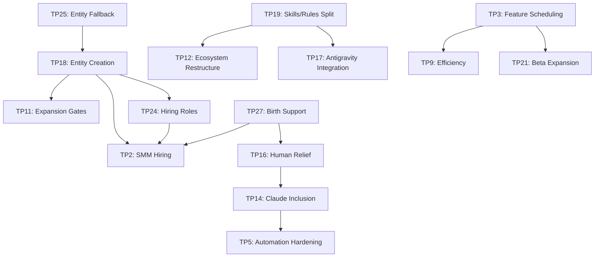

# Admin Huddle Briefing — 2026-05-06

## Session Context

- **Status:** Not commenced. All 28 topics seeded as `pending`.
- **Attendees:** HitM + spouse (sitting in).
- **Format:** Multi-day admin huddle. Topics move `pending → discussing → decided / deferred`.
- **Active strategic state:** Phase S1, Stage S1.B (Distribution Readiness), entered 2026-04-30.
- **Hard timeline pressure:** Baby due **2026-06-15** → ~5 weeks of full-velocity window remaining.

> [!IMPORTANT]
> Spouse is sitting in. Several topics directly involve her (entity registration TP18/TP25, hiring TP2/TP24, June schedule TP27). Prioritize those for sessions when she's present.

---

## Thematic Clusters

The 28 topics organize into 7 natural clusters. Working through clusters (not strictly sequential TP numbers) will reduce context-switching across sessions.

### Cluster A: Business Formation & Legal (TP11, TP18, TP25)

These are **the highest-stakes decisions** in the packet because they gate payment integration, hiring, and S1.B exit.

| Topic | Core Question | Pre-Seeded Material |
|-------|--------------|---------------------|
| **TP11** Business expansion gates | New hire gates, training vs OOS hires, legality research, lawyer retainer | Notes seed only |
| **TP18** Entity creation timelines | Feasibility vs velocity, cost breakpoints, legal doc handling, human expansion needs | Heavy cross-refs to TP9/10/11/14/15/16/19 |
| **TP25** Entity fallback if spouse backs out | Fallback legal paths, continuity plan, time/cost/risk deltas, trigger point | Notes seed only |

**Current strategic state:**
- Entity pipeline **locked** in `01_unit_economics.md` §5.0: PH spouse-led MoR + HitM US LLC vendor
- PayMongo primary PSP **signed** (PM1–PM4, 2026-05-05), ~2.0% blended wallet MDR
- **S1.B exit requires:** entity formation decision made + payment provider decision made
- Entity formation research plan is `draft` status — not yet executing

**Key tensions:**
- Spouse agreement is assumed but TP25 explicitly prepares for fallback → need honest conversation while she's present
- All business costs absorbed by HitM living funds — no separate business capital
- Legal docs require counsel; budget for lawyer retainer is undefined against ₱100/mo runtime cap (legal costs are separate from runtime)

**Decisions needed:**
1. Is spouse still committed to PH entity lead role?
2. If yes: timeline to SEC registration? (Marriage status dependency?)
3. If no: which fallback path (sole prop, different nominee)?
4. Budget allocation for lawyer retainer — one-time or monthly?
5. What trigger point forces a switch to fallback?

---

### Cluster B: Hiring & Human Scaling (TP2, TP16, TP24, TP27)

All hiring topics are **gated by entity formation** (Cluster A) and by budget reality.

| Topic | Core Question | Pre-Seeded Material |
|-------|--------------|---------------------|
| **TP2** SMM hiring balance inquiry | Jun/Jul hire dates, gated by birth costs | Notes seed |
| **TP16** Human relief points | Baby factor, automation vs human, what needs HitM hands-on | Notes seed |
| **TP24** Hirable positions & PH wages | Role design, wage bands, hiring model | [Full artifact](file:///home/pproctor/Documents/python/finance_manager/strategy/huddles/admin-meeting-huddle-prep-2026-05-06/PH_HIRING_ROLES_AND_WAGE_BANDS_BUDGET_CONSTRAINED.md) |
| **TP27** Birth support & June schedule | Sister's June availability, assistance coverage | Notes seed |

**Pre-seeded research artifacts:**

````carousel
**PH Hiring Roles & Wage Bands (Budget-Constrained)**

Four tiers defined:
- **Tier 0** (₱10k–20k): micro support, part-time tasks
- **Tier 1** (₱20k–35k): ops assistant, admin, SMM support
- **Tier 2** (₱35k–55k): technical ops coordinator
- **Tier 3** (₱55k–75k): junior engineer/orchestrator hybrid (budget edge)

Recommended sequence: start Tier 1/2 → prove capacity → Tier 3 only after gate

<!-- slide -->

**Device Eligibility & SMM Mobile Viability**

Three SMM tiers defined:
- **S1** (Mobile-Only): posting + basic moderation only
- **S2** (Mobile-Primary + Desktop Fallback): default for early hires
- **S3** (Desktop-Required): analytics, compliance, automation

Engineering and Admin Ops: **desktop mandatory, no exceptions**

<!-- slide -->

**Hardware Breakpoints (PH Market)**

- **BP1** (₱35k–70k): 16GB/512GB — minimum viable, friction expected
- **BP2** (₱75k–120k): 32GB/1TB — recommended baseline
- **BP3** (₱120k–220k): 64GB/1-2TB — future-proof, lead role

Landed cost model: device + shipping + setup labor + kernel hardening + troubleshooting + contingency

<!-- slide -->

**Procurement Matrix (100-Point Scoring)**

Weighted categories:
- Compute adequacy: 25pts
- Linux compatibility: 20pts
- Upgradeability: 15pts
- Procurement reliability: 15pts
- Total landed cost: 15pts
- Warranty/repair: 10pts

Pass threshold: **75+** with no zero-score category
````

**Key tensions:**
- Jun/Jul hire dates collide directly with baby due date (June 15)
- Birth costs are an unknown — gating hire budget
- HitM is sole operator; any hire requires onboarding capacity that doesn't exist yet
- Hardware provisioning (if engineering hire) adds ₱75k–120k one-time capital outlay
- No entity = no legal employment structure

**Decisions needed:**
1. Maximum monthly all-in headcount budget right now?
2. Which role first: Admin/Ops (Option A) or SMM (Option B)?
3. Part-time-first as default policy for first 1-2 hires?
4. Is Jun/Jul hiring realistic given birth timing, or defer to Aug+?
5. TP27: What's the sister's June availability? What gaps exist?

---

### Cluster C: Product Velocity & Feature Delivery (TP3, TP9, TP20, TP21)

| Topic | Core Question | Pre-Seeded Material |
|-------|--------------|---------------------|
| **TP3** Feature rollout scheduling | Sequencing S1.B features | Connects to S1.B README sequencing |
| **TP9** Efficiency improvement avenues | How to move faster | Notes seed only |
| **TP20** Increasing success chances | Broad success factors | Notes seed only |
| **TP21** Beta expansion protocols | Invite-only → controlled expansion | Notes seed |

**S1.B Feature Completion Projection:**

| Scenario | Timeline | Conditions |
|----------|----------|------------|
| **Aggressive** | 24–28 weeks (late 2026) | Minimal interruptions, fast verification loops |
| **Likely** | 30–40 weeks (late 2026 – early 2027) | Normal rework, existing gate pattern unchanged |
| **Conservative** | 40–52 weeks (mid 2027) | Repeated retests, frequent context switching |

> [!WARNING]
> The original S1.B exit window was **May–Jul 2026**. The projection artifact says this is **most likely outside that window**. Even the aggressive scenario pushes to late 2026. This needs explicit acknowledgment and timeline reset.

**Primary bottlenecks identified:**
1. Serialized feature flow (one feature at a time on inactive color)
2. Prerequisite workstreams competing for same operator capacity
3. Manual verification points
4. Context-switch costs across API/web/ops/governance
5. Paused PWA stream consuming future capacity

**Current S1.B sub-plan status:**

| Sub-plan | Status |
|----------|--------|
| drift-cleanup | ✅ completed |
| entity-formation-research | draft |
| payment-provider-research | draft (PSP decisions PM1–PM4 signed) |
| ai-economics-deep-dive | **shelved** (until entity + PSP land) |
| distribution-channel-research | draft |
| wedge-consistency-audit | draft |
| pwa-install-offline-sync-research | draft |
| pwa-implementation-branch | **paused** (network error + offline shell repro) |

**Feature plans (F-001 through F-013):** All in `draft` status. None in progress or ready.

**Decisions needed:**
1. Which scenario (A/B/C) is the planning baseline?
2. Which features can be reclassified as parallel-safe vs strictly serialized?
3. Should any features be cut from S1.B and pushed to S1.C?
4. Beta expansion: define tester submission channel beyond DMs?
5. What explicit monthly throughput target is realistic?

---

### Cluster D: Infrastructure & Automation (TP1, TP4, TP5, TP8, TP15, TP26)

| Topic | Core Question |
|-------|--------------|
| **TP1** Known issues | Continuous working list |
| **TP4** Infrastructure hardening | Production stability |
| **TP5** Automation hardening | Pipeline reliability |
| **TP8** HitM scheduling/task automation repairs | Personal workflow automation |
| **TP15** Slack fixes | May tie to other topics |
| **TP26** Security hardening | Proactive + defensive coding |

**Current infra state:**
- Blue-green Docker on VPS `:8443` — operational
- PWA implementation **paused** due to online tx network error + offline shell repro issues
- Slack/CLI bridge on **temporary hiatus**
- Cursor PA (headless) has had stability issues (conversations show recent `agent-prompt` failures)

**S1.B exit requires:**
- Bug fixes for Issues #1, #4, #7 shipped
- Email uniqueness S0 fix shipped
- `+Bill` hotfix retroactively committed

**Decisions needed:**
1. TP1: Establish a persistent known-issues registry format?
2. TP4: What's the minimum hardening bar before S1.B exit?
3. TP5: Which automation gaps cause the most HitM time drain?
4. TP26: Proactive vs reactive security controls — where to invest first?
5. TP15: Is Slack worth fixing now, or pivot to Discord (connects to TP23)?

---

### Cluster E: Tooling & Agent Architecture (TP7, TP14, TP17, TP19, TP22)

| Topic | Core Question |
|-------|--------------|
| **TP7** Workspace subagent commands alignment | Align commands with automation |
| **TP14** Claude inclusion into workflows | Pros/cons, cost model, role split |
| **TP17** Antigravity integration | Context window strength vs coding quality |
| **TP19** Agentic skills/rules split by domain | Admin vs engineering vs SMM scoping |
| **TP22** Governance export as Cursor doctrine | Installable governance for employees |

**TP14 cost model options (from notes seed):**

| Option | Monthly Cost |
|--------|-------------|
| Cursor increase to $200/mo | +$140/mo over current |
| Cursor $60/mo + Claude $100/mo max | +$100/mo over current |

> [!CAUTION]
> Both options **exceed** the ₱100/mo (~$1.80/mo) runtime cost cap. These are **HitM personal absorption** costs, not business runtime. Need clarity on which budget bucket these fall into and whether they're justified by velocity gains.

**Role split concept (TP14):**
- Code execution vs code review split
- DOM/browser verification → pass results back to code executors
- Ties into automation hardening (TP5)

**Decisions needed:**
1. TP14: Is Claude worth the cost given current budget constraints?
2. TP17: Define specific Antigravity usage gates (where/when allowed)?
3. TP19: Does domain-split require ecosystem restructure (TP12) first?
4. TP22: Is governance export premature before first hire?
5. TP7: What commands are misaligned and causing friction?

---

### Cluster F: Business Strategy & Market (TP10, TP23, TP28)

| Topic | Core Question |
|-------|--------------|
| **TP10** Business scalability in PH | Growth model |
| **TP23** Slack vs Discord for business | Platform comparison |
| **TP28** Business management software | Internal tooling |

**TP23 evaluation axes (from notes):**
- Platform costs
- Technical debt
- Time costs for restructuring automation pipelines
- Migration/switching overhead and lock-in risk
- Regional/business-structure fit risks

**TP28 considerations:**
- Build vs buy for internal business management
- Integration with existing automation and governance
- Minimum viable scope that doesn't derail core product

> [!NOTE]
> TP28 (building internal business management software) is a significant scope expansion. With S1.B already projected to slip, adding a new product stream — even internal — needs very careful justification.

---

### Cluster G: Governance & Process (TP6, TP12, TP13)

| Topic | Core Question |
|-------|--------------|
| **TP6** Glossary updates for admin terms | Vocabulary maintenance |
| **TP12** Ecosystem potential restructure | Repo/workspace reorganization |
| **TP13** Continual improvement meetings | Recurring review cadence |

**These are lower-stakes** process improvements. Consider handling in a single shorter session or deferring any that don't have immediate operational impact.

---

## Recommended Session Sequencing

Given the multi-day format, spouse attendance, and baby timeline pressure:

### Session 1: Legal & Entity (spouse-critical)
**Topics:** TP18, TP25, TP11
**Why first:** Gates everything else. Spouse needs to be present. Decisions here unlock Clusters B and parts of C.

### Session 2: Hiring & Human Relief
**Topics:** TP24, TP2, TP16, TP27
**Why second:** Depends on entity decisions from Session 1. Spouse input valuable for TP27 (June schedule).

### Session 3: Product Velocity Reality Check
**Topics:** TP3, TP9, TP20, TP21
**Why here:** With entity and hiring picture clearer, can realistically assess what S1.B delivery looks like.

### Session 4: Infrastructure & Security
**Topics:** TP1, TP4, TP5, TP26, TP15, TP8
**Why grouped:** Technical ops cluster; can be worked without spouse present.

### Session 5: Tooling & Agent Architecture
**Topics:** TP14, TP17, TP7, TP19, TP22
**Why here:** Depends on budget clarity from Sessions 1-2 and velocity discussion from Session 3.

### Session 6: Strategy & Wrap-up
**Topics:** TP10, TP23, TP28, TP6, TP12, TP13
**Why last:** Lower urgency; some may be deferred to a future huddle entirely.

---

## Critical Cross-Topic Dependencies



---

## Time-Critical Items (Baby Clock)

With ~5 weeks until June 15:

| Priority | Item | Why Urgent |
|----------|------|-----------|
| 🔴 | Entity decision (TP18/TP25) | Gates PSP KYB, which gates S1.B exit |
| 🔴 | June schedule clarity (TP27) | Must plan coverage before birth window |
| 🟡 | Hiring timing decision (TP2/TP24) | Jun/Jul dates need to be confirmed or deferred now |
| 🟡 | S1.B timeline reset (TP3) | Acknowledge slip; reset expectations before velocity drops |
| 🟢 | Tooling decisions (TP14/TP17) | Can be made post-baby if needed |
| 🟢 | Governance/process (TP6/12/13) | Low urgency; deferrable |

---

## Pre-Huddle Artifacts Summary

| Artifact | Relevant TPs | Key Content |
|----------|-------------|-------------|
| [TALKING_POINTS.md](file:///home/pproctor/Documents/python/finance_manager/strategy/huddles/admin-meeting-huddle-prep-2026-05-06/TALKING_POINTS.md) | All | Per-topic scaffold |
| [PH_HIRING_ROLES_AND_WAGE_BANDS_BUDGET_CONSTRAINED.md](file:///home/pproctor/Documents/python/finance_manager/strategy/huddles/admin-meeting-huddle-prep-2026-05-06/PH_HIRING_ROLES_AND_WAGE_BANDS_BUDGET_CONSTRAINED.md) | TP24 | Wage bands, role options, staged hiring |
| [PH_ENGINEERING_HARDWARE_BREAKPOINTS.md](file:///home/pproctor/Documents/python/finance_manager/strategy/huddles/admin-meeting-huddle-prep-2026-05-06/PH_ENGINEERING_HARDWARE_BREAKPOINTS.md) | TP24, TP2 | Compute tiers + PH pricing |
| [PH_ENGINEERING_HARDWARE_PROCUREMENT_MATRIX.md](file:///home/pproctor/Documents/python/finance_manager/strategy/huddles/admin-meeting-huddle-prep-2026-05-06/PH_ENGINEERING_HARDWARE_PROCUREMENT_MATRIX.md) | TP24, TP2 | 100-pt scoring rubric + landed-cost model |
| [DEVICE_ELIGIBILITY_POLICY_AND_SMM_MOBILE_VIABILITY.md](file:///home/pproctor/Documents/python/finance_manager/strategy/huddles/admin-meeting-huddle-prep-2026-05-06/DEVICE_ELIGIBILITY_POLICY_AND_SMM_MOBILE_VIABILITY.md) | TP2, TP24 | Role-based device requirements + SMM tiers |
| [S1B_FEATURE_COMPLETION_PROJECTION.md](file:///home/pproctor/Documents/python/finance_manager/strategy/huddles/admin-meeting-huddle-prep-2026-05-06/S1B_FEATURE_COMPLETION_PROJECTION.md) | TP3, TP9 | 24–52 week scenario bands |
| [validation_gates.md](file:///home/pproctor/Documents/python/finance_manager/strategy/strategic-roadmap-reframe-53be/validation_gates.md) | TP3, TP11, TP21 | S1.B exit criteria |
| [S1.B README](file:///home/pproctor/Documents/python/finance_manager/plans/S1/S1.B/README.md) | TP3, TP9 | Sub-plan index + sequencing |
| [00_strategic_context.md](file:///home/pproctor/Documents/python/finance_manager/strategy/strategic-roadmap-reframe-53be/00_strategic_context.md) | TP10, TP11, TP18 | Locked decisions + operating model |
| [01_unit_economics.md](file:///home/pproctor/Documents/python/finance_manager/strategy/strategic-roadmap-reframe-53be/01_unit_economics_and_costs.md) | TP18, TP24 | Cost caps + break-even math |

---

## How I Can Help During Sessions

During the huddle, I can:
- **Track decisions** in real-time (create `DECISIONS.md` when first decision locks)
- **Run cost calculations** for hiring scenarios, hardware procurement, or timeline projections
- **Draft policy text** for device eligibility, hiring gates, or security protocols
- **Update strategic documents** to reflect decisions as they're made
- **Research** PH-specific questions (wage benchmarks, legal requirements, platform comparisons)
- **Cross-reference** any topic against existing governance/plans/strategy docs

Ready to start when you are.
