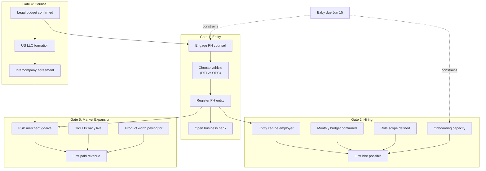

# TP11: Business Expansion Gates — Structured Discussion & Decision Matrix

**Huddle session:** 1 (Legal & Entity)  
**Status:** `decided` (2026-05-06 — most gates deferred post-baby; see decisions below)  
**Cross-refs:** → TP18 (entity timelines), → TP24 (hiring roles/wages), → TP2 (SMM hiring), → TP25 (entity fallback), → TP16 (human relief)

---

## Purpose

Define the **sequential gates** that must be cleared before the business can expand in each operational dimension: hiring, legal formation, spending, and market reach. This topic feeds directly into TP18 (entity creation timelines) by establishing *what triggers need an entity* vs *what can proceed without one*.

---

## Part 1: Gate Categories

Business expansion is not one decision. It breaks into **five distinct gate categories**, each with its own trigger conditions and dependencies.

### Gate 1 — Legal Entity Formation

**Question:** When does the business *need* a registered entity (vs operating as personal project)?


| Trigger                           | Why entity required                                | Which entity               | Status                                |
| --------------------------------- | -------------------------------------------------- | -------------------------- | ------------------------------------- |
| First paid revenue from strangers | PSP merchant KYB requires business registration    | PH entity (spouse-led MoR) | **Locked** (L2/L4 in entity research) |
| App store listing                 | Google Play / Apple require legal seller of record | PH or US entity            | Not yet triggered                     |
| Hiring employees                  | Employer obligations (SSS, PhilHealth, Pag-IBIG)   | PH entity for PH hires     | Not yet triggered                     |
| B2B contracts                     | Counterparty requires corporate signatory          | Either jurisdiction        | Not yet triggered                     |
| VAT threshold                     | BIR revenue registration                           | PH entity                  | Not yet triggered                     |


**Already decided:**

- Pipeline locked 2026-05-03: PH spouse-led + US LLC vendor (→ [entity-formation-research/DECISION_MATRIX.md](../../../../plans/S1/S1.B/entity-formation-research/DECISION_MATRIX.md))
- PayMongo primary PSP signed (PM1–PM4)

**Huddle outcome (2026-05-06):**

1. OPC **likely ruled out** for cost reasons. **DTI sole proprietorship preferred** — pending counsel confirmation.
2. No business loans — spouse will not take on debt. All costs from HitM personal funds. **Hard constraint.**
3. Entity registration deferred until post-baby financial picture is clear. Counsel engagement also deferred.

---

### Gate 2 — Hiring Gates

**Question:** What conditions must be true before the business can hire anyone?

#### Pre-conditions (all must be met before any hire):


| Pre-condition                                          | Current status                                                                                      | Blocking?                                            |
| ------------------------------------------------------ | --------------------------------------------------------------------------------------------------- | ---------------------------------------------------- |
| **Legal entity exists** to serve as employer           | Not registered yet                                                                                  | **YES** — cannot legally employ without entity       |
| **Budget for total employer cost** identified          | Not defined                                                                                         | **YES** — wage + SSS/PhilHealth/Pag-IBIG + equipment |
| **Role scope defined** with measurable deliverables    | Draft only (→ [PH wage bands artifact](../../PH_HIRING_ROLES_AND_WAGE_BANDS_BUDGET_CONSTRAINED.md)) | Partial                                              |
| **Onboarding capacity exists**                         | HitM is sole operator; baby due Jun 15                                                              | **HIGH RISK**                                        |
| **Revenue or capital** to sustain 3+ months of payroll | No revenue yet; personal funds only                                                                 | **YES**                                              |


#### Hiring gate sequence (proposed):

```
Entity registered → Budget confirmed → Role scoped → Onboarding plan → Trial hire (part-time)
     Gate H1            Gate H2           Gate H3          Gate H4            Gate H5
```

**Discussion prompts:**

1. Can we hire *before* entity registration using contractor/freelance agreements? (Legal grey area — counsel)
2. What monthly all-in headcount budget can HitM absorb from personal funds right now?
3. Is Jun/Jul hiring realistic given baby timing, or should Gate H4 require "post-birth stability period"?
4. Should first hire be contractor (task-packet, milestone pay) to avoid employer obligations entirely?

---

### Gate 3 — Training vs Out-of-School Hires

**Question:** Should the business hire experienced workers or fresh graduates?


| Factor                            | Experienced hire                                                       | Out-of-school / fresh grad                                  |
| --------------------------------- | ---------------------------------------------------------------------- | ----------------------------------------------------------- |
| **Wage band**                     | ₱35k–75k (Tier 2–3)                                                    | ₱10k–25k (Tier 0–1)                                         |
| **Time to productivity**          | 1–2 weeks with runbooks                                                | 4–8 weeks minimum                                           |
| **Onboarding burden on HitM**     | Medium — needs system orientation                                      | **High** — needs skill training + system orientation        |
| **Risk of output quality issues** | Lower                                                                  | Higher, especially for orchestration work                   |
| **Loyalty/retention**             | Market-rate expectations; may leave for better offer                   | Higher retention if growth path exists                      |
| **Availability in PH market**     | Competitive; good candidates get grabbed fast                          | Abundant supply; selection criteria matter more             |
| **Hardware provision required**   | Likely has own device (but business policy may require company device) | Almost certainly needs company-provided device              |
| **Governance learning curve**     | Can adapt with documentation                                           | Needs structured introduction to governance-heavy workflows |


**Key insight:** For the first hire, **onboarding burden is the critical variable**, not wage. HitM's capacity to train someone is at its lowest point (baby + sole operator). This argues for:

- **Experienced** if hiring for technical/orchestration (Tier 2+)
- **Fresh grad acceptable** only for strictly scoped admin/posting work (Tier 0–1) with zero-ambiguity runbooks

**Discussion prompts:**

1. Can HitM realistically onboard anyone in Jun–Aug given baby timing?
2. If yes: experienced (less HitM time, higher cost) or fresh grad (more HitM time, lower cost)?
3. What's the minimum documentation needed before *any* hire can start working independently?

---

### Gate 4 — Lawyer/Counsel Retainer Gates

**Question:** When does the business need legal counsel, and how much should it budget?

#### Counsel needs by category:


| Category                         | When needed                    | One-time or ongoing          | Est. cost range (PH)                 | Est. cost range (US)       |
| -------------------------------- | ------------------------------ | ---------------------------- | ------------------------------------ | -------------------------- |
| **Entity formation** (PH)        | Before B1 (first paid revenue) | One-time                     | ₱15k–50k                             | N/A                        |
| **Entity formation** (US LLC)    | Before B1 or concurrent        | One-time                     | N/A                                  | $500–$2,000                |
| **Intercompany agreement**       | Before PSP go-live             | One-time (+ periodic review) | ₱20k–80k                             | May overlap US attorney    |
| **ToS / Privacy / Refund**       | Before S1.C founding beta      | One-time (+ updates)         | ₱15k–40k                             | Review overlay $500–$1,500 |
| **Employment contracts** (PH)    | Before first hire (Gate H1)    | Per-hire template            | ₱10k–25k initial template            | N/A                        |
| **Anti-Dummy compliance review** | With entity formation          | One-time                     | Included in entity formation counsel | N/A                        |
| **Tax advisory** (PH + US)       | Before first revenue receipt   | Periodic                     | ₱10k–30k/yr                          | $1k–$3k/yr                 |
| **IP assignment**                | Before entity formation        | One-time                     | ₱5k–15k                              | $500–$1,000                |


#### Counsel engagement sequence (proposed):

```
Phase 1 (immediate):     Entity formation counsel (PH) + Anti-Dummy review
                          → coincides with TP18 entity timeline
Phase 2 (pre-revenue):   Intercompany agreement + US LLC formation
                          → must complete before PSP KYB merchant go-live
Phase 3 (pre-S1.C):      ToS/Privacy/Refund drafting
                          → S1.B exit requirement
Phase 4 (pre-hire):      Employment contract templates
                          → Gate H1 requirement
Phase 5 (ongoing):       Tax advisory (annual or semi-annual)
```

**Total estimated legal spend (Year 1, all phases):**


| Scenario                                   | PH counsel | US counsel | Total                        |
| ------------------------------------------ | ---------- | ---------- | ---------------------------- |
| **Lean** (sole prop DTI, minimal docs)     | ₱50k–80k   | $1k–2k     | ~~₱110k–190k (~~$2k–3.4k)    |
| **Standard** (OPC, full intercompany, ToS) | ₱100k–200k | $2k–4k     | ~~₱210k–420k (~~$3.8k–7.5k)  |
| **Conservative** (full corp, retainer, IP) | ₱200k–350k | $3k–6k     | ~~₱370k–690k (~~$6.6k–12.3k) |


> [!WARNING]
> All legal costs come from HitM personal funds. There is no business capital pool. Even the "lean" scenario is ₱50k–80k (~$900–1,400) in PH counsel alone — roughly 1–2 months of the current project overhead budget.

**Discussion prompts:**

1. What is HitM's maximum one-time legal spend tolerance right now?
2. Should Phase 1 counsel be engaged before or after this huddle concludes?
3. Can any counsel work be deferred by using template documents (e.g. open-source ToS, standardized PH sole prop registration)?
4. Is a formal retainer needed, or can counsel be engaged per-project?

---

### Gate 5 — Market Expansion Gates

**Question:** What must be true before expanding beyond invite-only beta?


| Gate                                | Trigger                                    | Status                              | S1.B exit?    |
| ----------------------------------- | ------------------------------------------ | ----------------------------------- | ------------- |
| E1 — Product is "worth paying for"  | Pro tier demonstrably better than notebook | **Not met** — features still draft  | Yes           |
| E2 — Entity registered + PSP live   | Can actually collect money                 | **Not met** — entity not registered | Yes           |
| E3 — Tester feedback channel exists | Beyond DMs to HitM                         | **Not met** — no formal channel     | No (but TP21) |
| E4 — ToS / Privacy / Refund live    | Legal protection for paid users            | **Not met** — not drafted           | Yes           |
| E5 — Content cadence defined        | Founder-level marketing rhythm             | **Not met** — research in draft     | Yes           |
| E6 — Founding member backend ready  | Seat cap + lifetime SKU + badge            | **Not met** — not built             | Yes           |


**Observation:** Gates E1–E6 map almost exactly to S1.B exit criteria. Business expansion beyond invite-only beta **IS** S1.B → S1.C transition. There is no intermediate expansion gate.

→ Connects to **TP21** (Beta expansion protocols) in Session 3.

---

## Part 2: Decision Matrix

### DM-1: Hiring readiness gate sequence

> **DECIDED (2026-05-06): DEFERRED post-baby.** No hiring commitments until post-baby finances stabilize and concrete budget is known. First hire identified: family member for SMM at ~₱10k/mo (part-time), but still gated to baby being a few months old + counsel on legal arrangement.


| Gate ID | Gate                              | Required before hire?             | Can be parallelized?                               | Owner          | Status                                                     |
| ------- | --------------------------------- | --------------------------------- | -------------------------------------------------- | -------------- | ---------------------------------------------------------- |
| H1      | Entity registered as employer     | **Mandatory** (unless contractor) | Can parallel with H2–H3 if using contractor bridge | HitM + counsel | **Deferred**                                               |
| H2      | Monthly budget confirmed          | **Mandatory**                     | Parallel with H1                                   | HitM           | **Blocked** — waiting on post-baby financial stabilization |
| H3      | Role scope + deliverables defined | **Mandatory**                     | Parallel with H1–H2                                | HitM           | Partial — family SMM at ~₱10k/mo identified                |
| H4      | Onboarding capacity available     | **Mandatory**                     | Sequential — after baby stabilization              | HitM           | **Blocked** — baby due Jun 15                              |
| H5      | Trial period (part-time first)    | **Recommended**                   | After H1–H4                                        | HitM + hire    | Not started                                                |


**HitM decision:** `[x]` **C — Defer all hiring to post-baby** (with family SMM hire as first target once gates clear)

**Additional constraints locked:**

- **No business loans.** Spouse will not take on debt burden. HitM supports.
- All employee/contractor costs from HitM personal funds.
- Legal structure for family member hire needs counsel input (→ DM-4).

---

### DM-2: Counsel engagement timing

> **DECIDED (2026-05-06): DEFERRED post-baby.** Counsel contact identified but formal engagement postponed until finances stabilize.

**HitM decision:** `[x]` **C — Defer until post-baby** (Jul+ earliest)

**Mitigating factor:** PH counsel lead is identified and warm (see DM-4 update). Can be activated quickly when budget allows, reducing the risk of the deferral.

**Accepted risk:** S1.B exit criteria requiring "entity formation decision made" will not be satisfied until counsel is engaged → S1.B timeline extends. **This is accepted** (see S1-D08 in SESSION_NOTES).

---

### DM-3: Training investment model for first hire

> **DECIDED (2026-05-06): DEFERRED to post-automation discussions** (→ TP5, TP14 in Session 5). Engineering hire likely not needed until S1.C or later.

**First hire identified:** Family member for **SMM (part-time, ~₱10k/mo)**. Below the Tier 0 floor from pre-seeded wage bands (family rate). Known person = reduced onboarding risk.

**HitM decision:** `[x]` **D variant — Family member SMM** (deferred to post-baby, ~Aug+ 2026)

**Engineering hire position:**

- HitM anticipates that if automation pipelines (with progress notifications) can handle engineering execution, a dedicated engineer is **not needed during S1.B**.
- Goal: HitM operates as admin/planner with automation doing execution → removes the largest stress category.
- Revisit at S1.C entry or if automation hardening outcomes (TP5, TP14) show gaps that require human engineering capacity.
- **Defer all Tier 2+ hiring decisions** to post-automation assessment.

---

### DM-4: Legality research — who does what

> **UPDATED (2026-05-06): PH counsel contact identified.** Landlord's property owner (the subletter above current landlord) is a **lawyer** with **US travel experience**. Has been informally notified of potential engagement. Strong fit for PH-side legal needs. **Not suited for US tax/FEIE** — separate US advisor still required.


| Research item                             | Can agent do?                                                                                                          | Needs counsel?    | Needs HitM? | Priority      | Counsel fit                        |
| ----------------------------------------- | ---------------------------------------------------------------------------------------------------------------------- | ----------------- | ----------- | ------------- | ---------------------------------- |
| PH DTI vs OPC comparison (structure)      | ✅ Drafted ([DTI_VS_OPC_COMPARISON.md](../../../../plans/S1/S1.B/entity-formation-research/DTI_VS_OPC_COMPARISON.md))   | ✅ Confirm         | Review      | P0            | ✅ PH counsel (identified)          |
| Anti-Dummy risk for spouse-led entity     | Partially (scaffold exists)                                                                                            | ✅ **Required**    | Attend      | P0            | ✅ PH counsel (identified)          |
| US LLC state selection (WY/DE/home)       | ✅ Drafted ([US_LLC path](../../../../plans/S1/S1.B/entity-formation-research/US_LLC_REGISTRATION_AND_TAX_PATHWAYS.md)) | ✅ Confirm for tax | Review      | P1            | ❌ Needs separate US counsel        |
| PH employer obligations (SSS/Phil/Pag)    | ✅ Can research                                                                                                         | ✅ Confirm rates   | Review      | P1 (pre-hire) | ✅ PH counsel (identified)          |
| Intercompany pricing (arm's length)       | ❌ Needs advisor                                                                                                        | ✅ **Required**    | Co-work     | P1            | ⚠️ PH counsel + US advisor jointly |
| Tax advisory (FEIE × PH income)           | ❌ Needs advisor                                                                                                        | ✅ **Required**    | Co-work     | P1            | ❌ Needs separate US counsel        |
| ToS / Privacy policy drafting             | ✅ Can draft from templates                                                                                             | ✅ Review          | Review      | P2 (pre-S1.C) | ✅ PH counsel (identified)          |
| Employment contract template (family SMM) | ✅ Can draft                                                                                                            | ✅ Must review     | Review      | P2 (pre-hire) | ✅ PH counsel (identified)          |


---

## Part 3: Dependency Chain Summary




---

## Part 4: Recommended Discussion Flow

Use this sequence during the session:

1. **Validate the gate categories** — are there gates missing? Any over-engineered?
2. **Gate 1 decisions** — entity vehicle choice (DTI vs OPC): what does counsel need to decide this? → feeds TP18
3. **Gate 4 decisions** — counsel timing: engage now or after huddle? Budget allocation
4. **Gate 2 decisions** — hiring timing: realistic pre-baby or defer? Contractor bridge acceptable?
5. **Gate 3 discussion** — experienced vs fresh grad: only relevant if hiring isn't fully deferred
6. **Gate 5 observation** — confirm that market expansion = S1.B exit; no intermediate expansion path exists
7. **Record decisions** in SESSION_NOTES.md decision table

---

## Strategic cross-references


| Document                                                                                                                                               | Relevance to TP11                                      |
| ------------------------------------------------------------------------------------------------------------------------------------------------------ | ------------------------------------------------------ |
| [entity-formation-research/README.md](../../../../plans/S1/S1.B/entity-formation-research/README.md)                                                   | Operating pipeline lock (§0.2), counsel posture (§0.4) |
| [entity-formation-research/DECISION_MATRIX.md](../../../../plans/S1/S1.B/entity-formation-research/DECISION_MATRIX.md)                                 | L1–L5 lock slots; vehicle shortlist                    |
| [entity-formation-research/REGISTRATION_BREAKPOINTS.md](../../../../plans/S1/S1.B/entity-formation-research/REGISTRATION_BREAKPOINTS.md)               | B1–B8: when entity becomes mandatory                   |
| [entity-formation-research/SPOUSE_INVOLVEMENT_REQUIREMENTS.md](../../../../plans/S1/S1.B/entity-formation-research/SPOUSE_INVOLVEMENT_REQUIREMENTS.md) | Anti-Dummy scaffold for spouse discussion              |
| [PH_HIRING_ROLES_AND_WAGE_BANDS_BUDGET_CONSTRAINED.md](../../PH_HIRING_ROLES_AND_WAGE_BANDS_BUDGET_CONSTRAINED.md)                                     | Tier 0–3 wage bands + role options A–D                 |
| [validation_gates.md](../../../../strategy/strategic-roadmap-reframe-53be/validation_gates.md)                                                         | S1.B exit criteria (entity + payment + features)       |
| [01_unit_economics_and_costs.md](../../../../strategy/strategic-roadmap-reframe-53be/01_unit_economics_and_costs.md)                                   | §5.0 operating pipeline lock; §1 overhead baseline     |
| [kill_commit_gates.md](../../../../strategy/strategic-roadmap-reframe-53be/kill_commit_gates.md)                                                       | §1 master kill gate; §6 quarterly self-review          |


